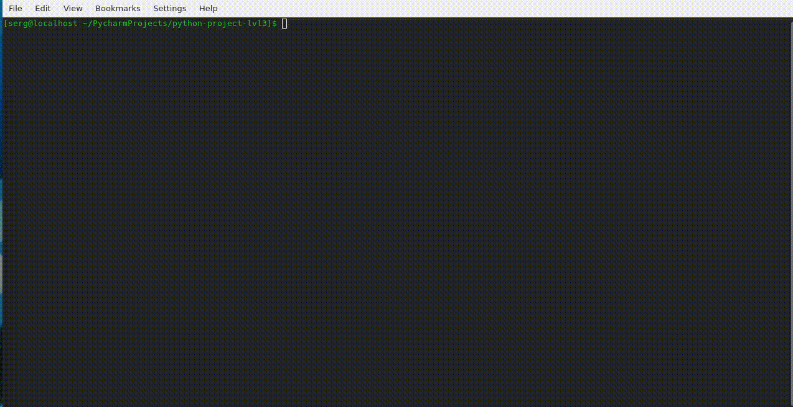
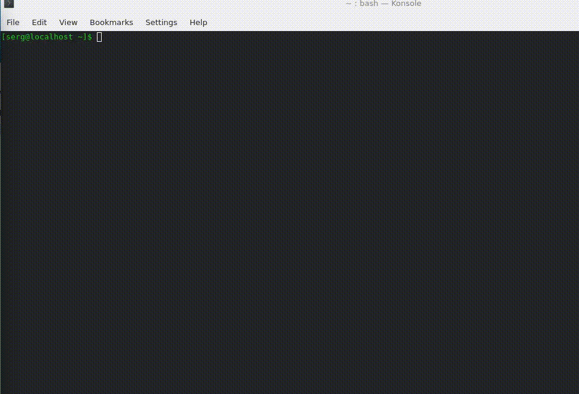

### Hexlet tests and linter status:
[](https://github.com/sergkot2020/python-project-lvl3/actions)
[](https://codeclimate.com/github/sergkot2020/python-project-lvl3/maintainability)
[](https://codeclimate.com/github/sergkot2020/python-project-lvl3/test_coverage)
[](https://github.com/sergkot2020/python-project-lvl3/actions/workflows/CI.yml)

## Installation
```python
make install
```


## Using
```python
page-loader http://www.school.unn.ru/ --output /home/serg
```
